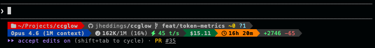

# ccglow

**Your Claude Code statusline, built to impress.**

Single binary. Zero dependencies. Pure ANSI. Infinite composability.


That's the full preset. Want something with more personality? Meet the F1 preset — powerline segments, truecolor, multi-line layout:



Every piece of data you see — path, branch, diffs, tokens, cost, duration — is
an independent segment you can rearrange, restyle, or remove. Build exactly the
statusline you want.

## 🚀 Quick Start

Install with `go install`:

```sh
go install github.com/jheddings/ccglow@latest
```

Then tell Claude Code to use it:

> Set my statusline to use ccglow from https://github.com/jheddings/ccglow

Or add it to `~/.claude/settings.json` directly:

```json
{
  "statusLine": {
    "type": "command",
    "command": "ccglow",
    "padding": 0
  }
}
```

That's it. One binary, no runtime dependencies, no config files required.

## 🎨 Presets

Five built-in layouts, from minimal to maximal.

**default** — the essentials: path, branch, diffs, context, duration

```
~/Projects/ccglow |  main · +5 -3 | 360K (36%) · 2h 15m
```

**minimal** — just the facts

```
ccglow | main | 360K/1M
```

**full** — everything, all at once

```
~/Projects/ccglow |  main · +5 -3 | Opus 4.6 · 360K/1M (36%) · $12.50 · 2h 15m · +1200 -85
```

**f1** — multi-line, powerline-styled, truecolor. Requires a [Nerd Font](https://www.nerdfonts.com/).

**moonwalk** — dark forest theme with powerline separators. Also requires a Nerd Font.

Switch presets with `--preset`:

```sh
ccglow --preset=minimal
ccglow --preset=f1
```

## 🔧 Customization

Presets are just starting points. Use `--config` to load your own layout:

```sh
ccglow --config ~/.claude/ccglow.json
```

A config is a JSON file with a `segments` array. Each segment has a type, optional style, and optional children:

```json
{
  "segments": [
    {
      "segment": "pwd.smart",
      "style": { "color": "31" }
    },
    {
      "segment": "pwd.name",
      "style": { "color": "39", "bold": true }
    },
    {
      "segment": "git",
      "style": { "prefix": " | ", "color": "240" },
      "children": [
        {
          "segment": "git.branch",
          "style": { "color": "whiteBright", "bold": true, "prefix": "\ue0a0 " }
        },
        {
          "segment": "git.insertions",
          "style": { "color": "green", "prefix": " +" }
        },
        {
          "segment": "git.deletions",
          "style": { "color": "red", "prefix": " -" }
        }
      ]
    }
  ]
}
```

Groups auto-collapse when all their children are empty — no dangling
separators, no ghost brackets. If there's no git repo, the git group just
disappears.

For the full reference:

- 📖 **[Segment Reference](docs/SEGMENTS.md)** — all available segments, what they render, special properties
- 🎨 **[Style Reference](docs/STYLE.md)** — colors, attributes, formatting options

## ⌨️ CLI Options

```
Usage: ccglow [flags]

Flags:
  --preset <name>     Use a named preset (default, minimal, full, f1, moonwalk)
  --config <path>     Load JSON config file
  --format <type>     Output format: ansi (default), plain
  --tee <path>        Write raw stdin JSON to file before processing
  --help              Show help
  --version           Show version
```

## 📦 Building from Source

```sh
go build -o ccglow .
```

## Links

- [**Releases**](https://github.com/jheddings/ccglow/releases) — download pre-built binaries
- [**Report a Bug**](https://github.com/jheddings/ccglow/issues/new?labels=bug) — something broken? let us know
- [**Request a Feature**](https://github.com/jheddings/ccglow/issues/new?labels=enhancement) — got an idea? we're listening

## License

MIT
